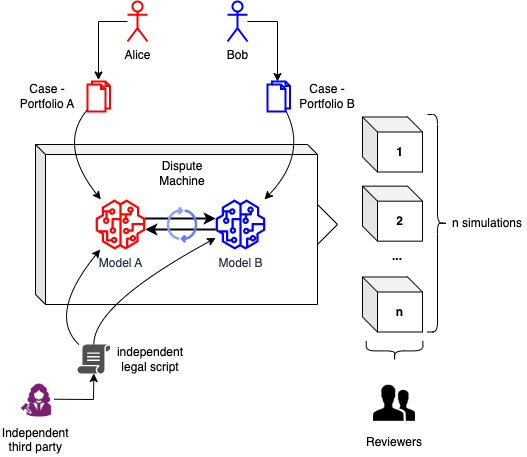

# 1. Dispute Machine: Prototype of an AI-based MAS infrastructure for the resolution of small-scale civil disputes
This project represents the final prototype created in the context of the class "Artificial Intelligence: Technology and Law (FS25)" at the University of Zurich (UZH): https://www.ius.uzh.ch/de/staff/professorships/alphabetical/thouvenin/lv/AI2025.html.

Our objective is to showcase the ”dispute machine”, the prototype of a system that can simulate small-scale civil disputes based on a set of predefined legal scenarios involving two natural persons.
You can see an schematic diagram of the designed systems below:

# 2. Features
This prototype is built upon "LocalGPT" (https://github.com/PromtEngineer/localGPT/blob/main/README.md), a project to converse with your documents without compromising your privacy.

# 3. What was changed in respect to localGPT
## 3.1 Agent Embeddings
The program `ingest_combined.py` makes use of the embedding-creation infrastructure setup by localGPT to create embeddings for multiple agents, each stored in folders `./data/portfolio_{X/Y}`. After execution, the stored files in the portfolio folders are used to created the embeddings.

## 3.2 Multi-Agent Conversation Infrastructure
The biggest change to localGPT is, that the two sides of the conversation are now both Large Language Models (and not anymore User & LLM). Therefore a process had to be designed how a dispute can take place over a defined number of rounds. Multiple code segments were created to facilitate this (see complete code in `main.py`):
- The `Agent` class facilitates the instantiation of one LLM per dispute party, the usage of agent-specific embeddings, and question/answer pipelines (using the `ask(query)` function).
- The agent states `agent_state_{x/y}` dictionaries allow for agent specific data, such as persona data, conversation type, dispute context, and role.
- The function `prompt(agent_state: dict, round_number: int, total_rounds: int)` creates the prompt used for the dispute rounds.
- The conversation loop in the `main()` function facilitates the conversation between the agents in a TIT_FOR_TAT manner while recording the current conversation history and agent states.

# 4. How to use
The dispute machine uses the same libraries as localGPT and therefore does not require for an additional `requirements.txt`. These requirements are a prerequisite for the dispute machine to work.

The process to start simulating disputes is as follows:
1. Store the files that compose the agent portfolios in the respective folders folders `./data/portfolio_{X/Y}`.
2. Run the file `ingest_combined.py` to create the persistent folders of the file embeddings.
3. Define the arguing parties in the dictionaries `agent_state_{x/y}`.
4. Define the desired numbers of simulations and rounds in the main function.
5. Run `main.py` to run the simulations.

The used models for the agents are defined in `constants.py` and can be changed. Models are downloaded automatically if not already done so. Authentication requirements for gated models may exist. 